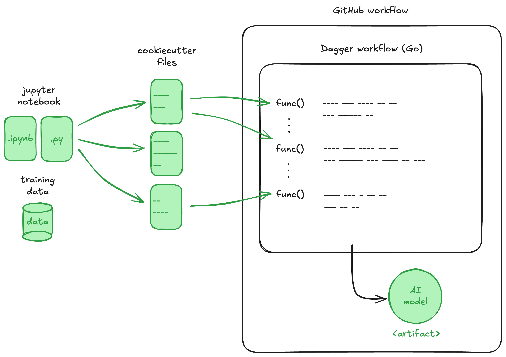
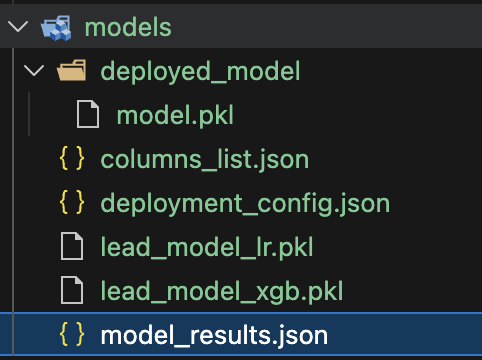

# MLOps Project 2025 - The Deploy Squad

<a target="_blank" href="https://cookiecutter-data-science.drivendata.org/">
    
</a>

This project is related to the Data Science in Production: MLOps and Software Engineering course. We develop a system that can predict whether a user will become a new customer. The original repository can be found [here](https://github.com/lasselundstenjensen/itu-sdse-project)



## Project Organization

```
├── LICENSE            <- Open-source license if one is chosen
├── Makefile           <- Makefile with convenience commands like `make data` or `make train`
├── README.md          <- The top-level README for developers using this project.
├── data
│   ├── external       <- Data from third-party sources.
│   ├── interim        <- Intermediate data that has been transformed.
│   ├── processed      <- The final, canonical data sets for modeling.
│   └── raw            <- The original, immutable data dump.
│
├── models             <- Trained and serialized models, model predictions, or model summaries
│
├── go.mod                           <- Go file that defines the module and required dependencies
│
├── go.sum                           <- Go file that ensures continuity and integrity of dependencies
│
├── pipeline.go                      <- Dagger workflow written in Go
│
├── notebooks          <- Jupyter notebooks. The naming convention is a number (for ordering),
│                         the creator's initials, and a short `-` delimited description, e.g.
│                         `1.0-jqp-initial-data-exploration`.
│
├── pyproject.toml     <- Project configuration file with package metadata for 
│                         new_customers_classifier and configuration for tools like black
│
├── references         <- Additional explanatory materials.
│
├── setup.cfg          <- Configuration file for flake8
│
└── new_customers_classifier   <- Source code for use in this project.
    │
    ├── __init__.py             <- Makes new_customers_classifier a Python module
    │
    ├── 01_preprocessing.py   <- Script for preprocessing the raw data for model training 
    │
    ├── 02_model_dev.py             <- Script for training prediction models
    │
    ├── 03_model_selection.py             <- Script for model comparison and selection
    │
    ├── 04_deploy.py             <- Script for deploying the best model
    |
    ├── config.py               <- Store useful variables and configuration
    | 
    ├── utils.py                 <- Helper functions used in the scripts
```
# How to run actions

# How to run the code locally

## Required tools and their respective versions
For pipeline tests:
- `docker` (Server): >= 4.54
- `dagger` >= 0.19.8
  
For local development:
- `go` - 1.25.0
- `git` >= 2.43.0
- `python` >= 3.12
- `make` >= 4.4.1 

## Run the pipeline inside a container

```shell
dagger run go run pipeline.go
```
### Results
The results of the pipeline are extracted into the 'models' folder. The container returns one pickle file from each model type developed in the pipeline, information for test performance in a JSON file, information for the final selected model and a subfolder with the best model (python_model.pkl).



### Pipeline testing
```shell
make test
```

## Set up for development

### How to set up your environment 
Install the tools needed for development.
Then run the following in the terminal

```shell
pip install -e .
```

### Directly running the scripts locally
Run all scripts from the project root directory to ensure paths resolve correctly.

Execute scripts as modules using the `-m` flag:

```shell
python -m new_customers_classifier.<script_name>
```

Alternatively, use the Makefile targets (e.g. make train, make deploy).

--------

